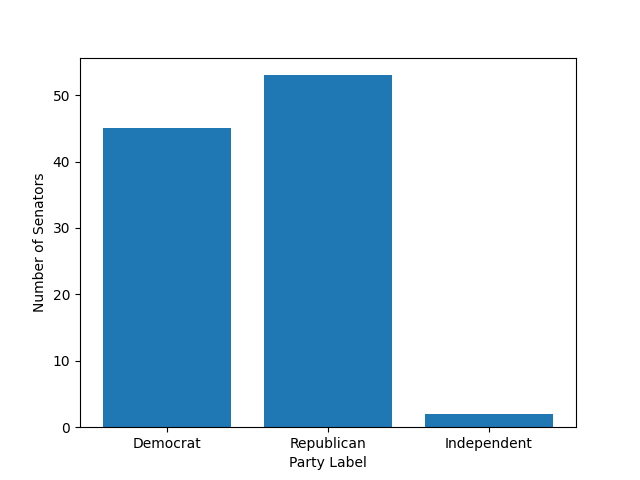
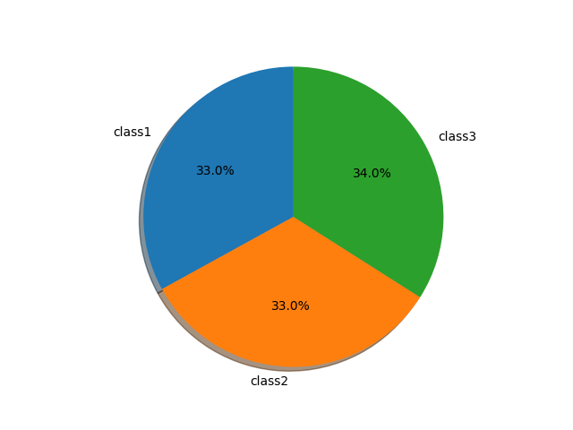

# CSCI40 HW 02: US Senators Dataset
**Party Affiliation of US Senators**

For this bar graph, I focused on the party affiliation of United States Senators. The Independents within the Senate are Bernie Sanders and Angus King. 
https://www.govtrack.us/api/v2/role?current=true&role_type=senator
**Classes of US Senators**

https://www.govtrack.us/api/v2/role?current=true&role_type=senator
Project Webpage: https://github.com/mikeizbicki/cmc-csci040/tree/2020fall/hw_02
